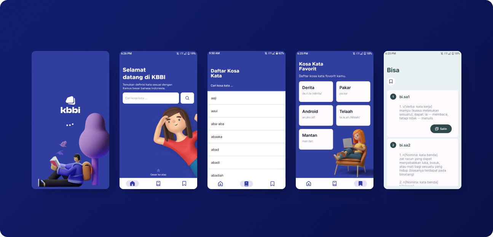
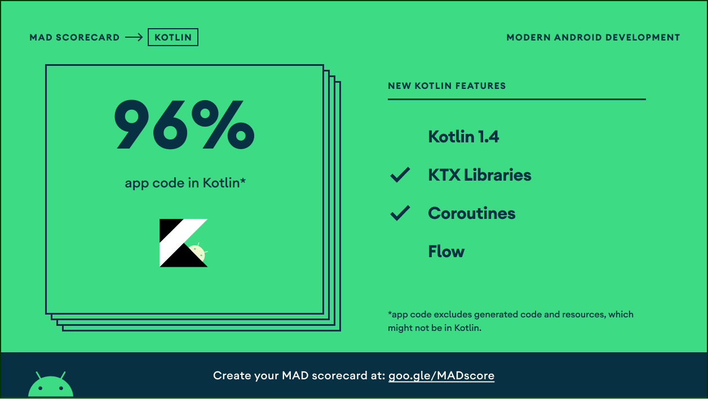
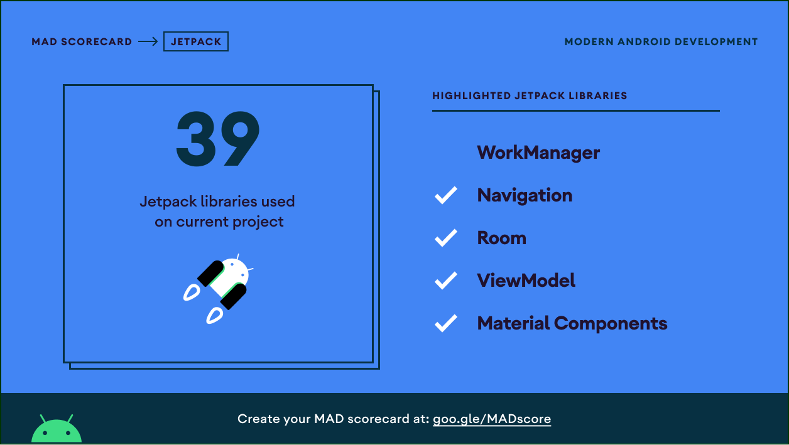

# KBBI

KBBI is an unofficial Android dictionary for **Kamus Besar Bahasa Indonesia**, built for fast lookup, offline-friendly reading, proverbs, translations, bookmarks, and daily learning reminders.

<p align="center">
  <a href="https://github.com/arrazyfathan/kbbi/releases/download/5.15.1/kbbi-v5.15.1-release.apk"><strong>⬇ Download KBBI 5.15.1 APK</strong></a>
  ·
  <a href="https://github.com/arrazyfathan/kbbi/releases/latest">Latest release notes</a>
</p>

<p align="center">
  <a href="https://opensource.org/licenses/Apache-2.0"></a>
  <a href="https://android-arsenal.com/api?level=23"></a>
  <a href="https://github.com/arrazyfathan/kbbi/releases/latest"></a>
</p>

> The APK is distributed through GitHub Releases. Android may ask you to allow installation from your browser or file manager. Verify that the download comes from `github.com/arrazyfathan/kbbi` before installing it.

<p align="center">
  
</p>

## About the project

This repository contains the Android client for KBBI. It combines a remote dictionary service with a bundled local word index and on-device Room caches. A successful lookup is cached so previously opened content can remain available when the network is unavailable.

The app does not require an account. Bookmarks, search history, cached content, reminder preferences, language selection, and haptic preferences are stored locally on the device.

KBBI is an unofficial project and is not operated by or affiliated with the Indonesian government or the official KBBI publisher.

## Features

### Dictionary and discovery

- Search Indonesian words and meanings from the home screen.
- Get suggestions from the bundled local word index before submitting a search.
- Browse and filter the complete bundled word-entry list.
- Use Android speech recognition for voice search.
- Show optional word and meaning translations in the detail screen.
- Copy or share formatted definitions through Android's share sheet.

### Offline-friendly local data

- Cache successful word lookups in Room.
- Reopen cached meanings without a network connection.
- Cache proverb pages and proverb details for fallback when the remote service fails.
- Preserve cached meanings when a bookmark is removed.
- Store recent search history locally and clear it from Settings.

### Proverbs and bookmarks

- Browse and search Indonesian proverbs with Paging 3.
- Open proverb meanings with remote-first, cache-fallback behavior.
- Save words as bookmarks and remove them with long-press actions.
- Open bookmark, word, and proverb destinations from notifications and deep links.

### Android integrations

- Search selected text through Android's `ACTION_PROCESS_TEXT` menu.
- Receive shared `text/plain` content from other apps.
- Handle `kbbi://word/{word}`, `kbbi://proverb/{slug}`, and `kbbi://bookmarks` links.
- Provide launcher shortcuts for search, bookmarks, proverbs, and a random word.
- Schedule daily word, daily proverb, and bookmark-review reminders with WorkManager.
- Request microphone and notification permissions only when their related feature is used.

### Settings and app experience

- Choose English or Indonesian as the application language.
- Configure reminder types and delivery times independently.
- Enable or disable semantic haptic feedback across the application.
- Check GitHub Releases for app updates and download a newer APK.
- View privacy policy, terms and conditions, and open-source licenses in the app.
- Use Material 3, edge-to-edge layouts, animated transitions, and Lottie states.

<p align="right">
  
</p>

## Architecture

KBBI is a multi-module Android project organized by feature and layer. Dependencies point inward toward domain contracts:

```text
:app
  ├── application startup and Koin assembly
  ├── Navigation3 root graph and external-intent routing
  ├── notification permission and WorkManager adapters
  └── application-wide UI coordination

:feature:<name>:presentation
  ├── feature domain contracts
  ├── :core:domain
  ├── :core:presentation:ui
  └── :core:presentation:designsystem

:feature:<name>:data
  ├── feature domain contracts
  ├── :core:data
  ├── :core:domain
  └── :core:logging

:feature:<name>:domain
  └── domain models, repository interfaces, and use cases
```

Presentation follows an MVI-style unidirectional flow with immutable screen state, user actions, ViewModels, and one-shot events. Koin assembles implementations at the application boundary.

### Module map

```text
.
├── app/
│   ├── di/                         # App-level use-case and ViewModel registration
│   ├── intent/                     # External text, sharing, and deep-link parsing
│   ├── navigation/                 # Navigation3 graph, routes, and shortcuts
│   ├── notifications/              # WorkManager scheduler, worker, permission gateway
│   └── ui/                         # Application-wide UI state
├── core/
│   ├── app-update/                 # GitHub release checks and update prompt
│   ├── data/                       # Shared Ktor client and safe API calls
│   ├── di/                         # Shared Koin modules
│   ├── domain/                     # AppResult, DataError, shared primitives
│   ├── logging/                    # Application and network logging
│   ├── presentation/
│   │   ├── designsystem/           # Theme, typography, resources, haptics, components
│   │   └── ui/                     # UiText, alerts, errors, loading coordination
│   └── utils/                      # System-bar and voice-recognition helpers
├── feature/
│   ├── bookmark/presentation/      # Saved-word UI and deletion flow
│   ├── detail/presentation/        # Meanings, translation, copy/share, bookmark state
│   ├── home/
│   │   ├── data/                   # Word Room DB, remote API, bundled catalog
│   │   ├── domain/                 # Word/search/bookmark/translation contracts
│   │   └── presentation/           # Search, suggestions, history, voice input
│   ├── proverb/
│   │   ├── data/                   # Paging, remote source, Room cache
│   │   ├── domain/                 # Proverb contracts and use cases
│   │   └── presentation/           # Proverb list, search, and meaning UI
│   ├── settings/
│   │   ├── data/                   # DataStore preference implementations
│   │   ├── domain/                 # Reminder and UI preference contracts
│   │   └── presentation/           # Settings, language, legal documents
│   ├── splash/presentation/        # Animated startup screen
│   └── words/presentation/         # Searchable local word list
├── .github/workflows/              # Validation and tagged release pipeline
├── fastlane/                       # Local automation
└── gradle/libs.versions.toml        # Dependency and plugin versions
```

## Data flow

### Word lookup

1. The query is normalized and validated by the domain use case.
2. Local suggestions come from `feature/home/data/src/main/assets/entries.json`.
3. `WordRepository` checks `kbbi_db` for a cached entry.
4. Cached data is returned immediately when available.
5. A cache miss requests the configured dictionary API.
6. A successful response is persisted in Room.
7. Bookmarking changes the stored entry's `isSaved` flag; removing a bookmark keeps its cached meaning.

The bundled asset contains word entries, not full definitions. A word must be opened successfully at least once before its meaning is available offline.

### Proverb lookup

1. `ProverbViewModel` debounces the search query.
2. Paging loads matching pages from the remote API.
3. Successful pages are cached in `proverb_db`.
4. Cached pages are used when a remote page fails.
5. Proverb details are remote-first and cached by slug for later fallback.

### Preferences and reminders

- DataStore persists reminder configuration and haptic preferences.
- WorkManager schedules unique periodic work for each enabled reminder type.
- Notification taps route back into the appropriate word, proverb, or bookmark destination.
- App language is stored through AndroidX per-app locale APIs.

## Technology

| Area | Technology |
|---|---|
| Language | Kotlin 2.4.10, Java 17 target |
| Build | Gradle 9.7.1, Android Gradle Plugin 9.3.1, KSP |
| Android | Minimum SDK 23, target/compile SDK 37 |
| UI | Jetpack Compose BOM 2026.08.00, Material 3, Lottie |
| Navigation | AndroidX Navigation3 |
| State | ViewModel, StateFlow, coroutines, channel-backed events |
| Networking | Ktor Client 3.5.2 with OkHttp and kotlinx.serialization |
| Persistence | Room 2.8.4, Preferences DataStore 1.2.1 |
| Background work | WorkManager 2.11.2 |
| Dependency injection | Koin 4.2.2 |
| Lists | Paging 3.5.1 |
| Quality | Android Lint, Detekt, Ktlint, Kover |
| Automation | GitHub Actions, Fastlane, Renovate |

Dependency versions are centralized in [`gradle/libs.versions.toml`](gradle/libs.versions.toml).

## Requirements

- Android Studio with Android SDK 37 installed
- JDK 17
- Git
- Access to a compatible KBBI API base URL
- Android device or emulator running API 23 or newer

## Local setup

### 1. Clone the repository

```sh
git clone https://github.com/arrazyfathan/kbbi.git
cd kbbi
```

### 2. Configure local properties

Create `local.properties` and provide both the Android SDK path and API URL:

```properties
sdk.dir=/absolute/path/to/Android/sdk
KBBI_BASE_URL=https://your-compatible-api.example/
```

`KBBI_BASE_URL` may instead be passed as a Gradle property or environment variable:

```sh
./gradlew -PKBBI_BASE_URL=https://your-compatible-api.example/ help
```

The build fails early when no API URL is configured. Keep private endpoints and credentials out of version control.

### 3. Build or install the development variant

```sh
./gradlew assembleDevelopmentDebug
./gradlew installDevelopmentDebug
```

In Android Studio, select the `developmentDebug` build variant and run the `app` configuration.

## Firebase App Distribution

Development builds can be distributed to Firebase App Distribution by pushing a tag whose name exactly matches the development `versionName`, including the `-dev` suffix. For example:

```sh
git tag 5.21.5-dev
git push origin 5.21.5-dev
```

The workflow validates tests, lint, and the `developmentDebug` APK before uploading it with `appDistributionUploadDevelopmentDebug`. Branch pushes and pull requests remain validation-only. Production tags continue to publish the signed production APK as a GitHub Release.

The configured tester is listed in [`app/firebase/testers.txt`](app/firebase/testers.txt). CI generates [`app/firebase/release-notes.txt`](app/firebase/release-notes.txt) from commits since the nearest preceding reachable tag before uploading; the tracked file documents the canonical input path.

Tagged development distribution requires the `FIREBASE_APP_DISTRIBUTION_SERVICE_ACCOUNT_JSON` GitHub Actions secret containing the complete Google service-account JSON. Grant the service account the Firebase App Distribution Admin role, store the key only in GitHub Actions secrets, and follow Firebase's [service-account authentication guidance](https://firebase.google.com/docs/app-distribution/authenticate-service-account). The upload is configured through Firebase's [official Gradle plugin](https://firebase.google.com/docs/app-distribution/android/distribute-gradle).

## Build variants and versioning

The `stage` flavor dimension defines:

| Variant | Application ID | App label |
|---|---|---|
| `development` | `com.arrazyfathan.kbbi.dev` | `Dev KBBI` |
| `production` | `com.arrazyfathan.kbbi` | `KBBI` |

Common tasks:

```sh
./gradlew assembleDevelopmentDebug
./gradlew assembleProductionDebug
```

Version components come from [`app/version.properties`](app/version.properties). Release APK names are generated as:

- Production: `kbbi-v<version>-release.apk`
- Other flavors: `kbbi-<flavor>-v<version>-release.apk`

## Testing and quality

Run the same validation used by CI:

```sh
./gradlew testDevelopmentDebugUnitTest lintDevelopmentDebug assembleDevelopmentDebug --stacktrace
```

Additional checks:

```sh
./gradlew detekt
./gradlew ktlintCheck
```

Run connected Android tests on an emulator or device:

```sh
./gradlew connectedDevelopmentDebugAndroidTest
```

Generate Kover coverage for the application variant:

```sh
./gradlew :app:koverLogDevelopmentDebug
./gradlew :app:koverHtmlReportDevelopmentDebug
```

The HTML report is written under `app/build/reports/kover/`.

Tests cover domain use cases, remote and local data behavior, mapping, app updates, external intents, shortcuts, ViewModels, settings, Room, legal screens, and design-system components.

## Permissions

| Permission | Purpose |
|---|---|
| Internet/network state | Dictionary, translation, proverb, and release requests |
| Microphone | Voice search; requested when voice search is used |
| Notifications | Daily reminders; requested when a reminder is enabled on Android 13+ |

Haptic feedback uses Android's semantic Compose haptic API and does not require the `VIBRATE` permission.

## Release signing

Production release packaging is blocked unless all signing values are supplied as Gradle properties or environment variables:

```text
ANDROID_KEYSTORE_PATH
ANDROID_KEYSTORE_PASSWORD
ANDROID_KEY_ALIAS
ANDROID_KEY_PASSWORD
```

Example:

```sh
export ANDROID_KEYSTORE_PATH=/absolute/path/to/release.keystore
export ANDROID_KEYSTORE_PASSWORD=your-store-password
export ANDROID_KEY_ALIAS=your-key-alias
export ANDROID_KEY_PASSWORD=your-key-password
./gradlew assembleProductionRelease
```

## CI/CD and releases

The workflow in [`.github/workflows/android.yml`](.github/workflows/android.yml) performs the following:

- Pull requests and pushes to `main`: unit tests, Android lint, and a development debug APK.
- Version tags: signed production APK build, artifact upload, generated commit notes, and GitHub Release publication.

Release secrets:

- `KBBI_BASE_URL`
- `ANDROID_KEYSTORE_BASE64`
- `ANDROID_KEYSTORE_PASSWORD`
- `ANDROID_KEY_ALIAS`
- `ANDROID_KEY_PASSWORD`

Fastlane currently provides `bundle exec fastlane android test`, which delegates to Gradle tests.

## Project documentation

- [Future development roadmap](docs/future-development.md)
- [Architecture evolution notes](planning.md)
- [Fastlane configuration](fastlane/README.md)
- [GitHub releases](https://github.com/arrazyfathan/kbbi/releases)
- [Issue tracker](https://github.com/arrazyfathan/kbbi/issues)

## Screenshots and metrics

### MAD Score





## License

```text
Designed and developed by 2022 arrazyfathan (Ar Razy Fathan Rabbani)

Licensed under the Apache License, Version 2.0 (the "License");
you may not use this file except in compliance with the License.
You may obtain a copy of the License at

https://www.apache.org/licenses/LICENSE-2.0

Unless required by applicable law or agreed to in writing, software
distributed under the License is distributed on an "AS IS" BASIS,
WITHOUT WARRANTIES OR CONDITIONS OF ANY KIND, either express or implied.
See the License for the specific language governing permissions and
limitations under the License.
```
